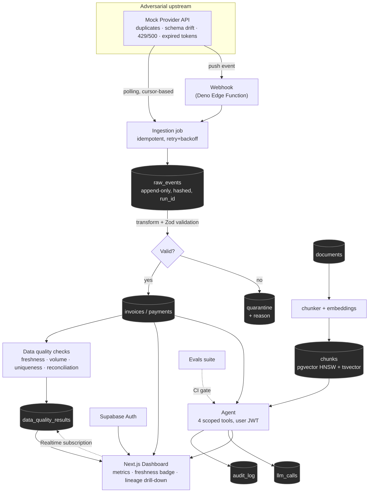

# LedgerLens

**An AI copilot over financial data you can actually trust.**

Next.js · Supabase/Postgres · pgvector · Pulumi · Bun · Node.
Current state and what is next: [`PROGRESS.md`](PROGRESS.md).

---

## What it is

Most "AI on your data" projects go straight to a chat UI wrapped around
whatever happens to be in the database. That is the easy 20%. LedgerLens
inverts the emphasis: the pipeline that guarantees the numbers are *right* is
the bulk of the work, and the AI sits on top as a thin, safety-constrained
layer — because an LLM layered on unvalidated data does not fix bad data, it
makes wrong numbers sound more convincing.

Concretely: a small multi-tenant app that ingests invoices from a
**deliberately adversarial** third-party API, validates and reconciles them,
and puts a copilot on top — one that can only answer from data it can prove,
and can only act within tools narrow enough that a poisoned document in its
own corpus cannot make it do damage.

It is built to show three things at once: product full-stack delivery,
reliable data pipelines, and safe agentic AI.

---

## Running it locally

Needs [Task](https://taskfile.dev), the
[Supabase CLI](https://supabase.com/docs/guides/local-development/cli/getting-started),
[Bun](https://bun.sh), [Node 22+](https://nodejs.org),
[Deno](https://deno.land), and Docker — Docker for the Supabase stack, which
is the only thing that runs in a container.

```bash
task install                             # dependencies
cp supabase/.env.example supabase/.env   # the Edge Function's shared secret
task dev-up                              # local Supabase in Docker: migrations + two-tenant seed
task env                                 # writes .env.local from the running stack
task dev                                 # http://localhost:3000 — hot reload, IDE debugger on 9231
```

```bash
task                    # every command, grouped
task check              # typecheck, lint, unit tests, deno check — needs nothing running
task verify             # that, plus types-check and the Playwright suite
task docker-up          # optional: the production image, beside the stack
```

The app, its checks and the Playwright suite all run on your machine. Bun
installs dependencies and runs the unit tests, Node 22 builds and serves,
Deno covers `supabase/functions/` alone, and Docker runs the Supabase stack.
The app's container image is an occasional smoke check, not a development
environment, and not what Vercel runs —
[ADR 0006](.claude/adr/0006-the-app-is-containerised-the-supabase-stack-is-not-duplicated.md).

Verifying a stage by hand, curl recipes, IDE debugger and database
connections: [`docs/LOCAL_DEV.md`](docs/LOCAL_DEV.md).

---

## Architecture



Invariants that hold everywhere: Postgres **RLS scoped by `org_id` on every
table**, a `correlation_id` on every log line, a `run_id` on every data row,
PII masked wherever it reaches a log or the audit table, and secrets that never
leave `env` / Supabase Vault / Pulumi's secret store.

Stage-by-stage detail, the entity-relationship diagram and the agent safety
flow: [`docs/PROJECT_OVERVIEW.md`](docs/PROJECT_OVERVIEW.md). Column-level DDL
and every RLS policy: [`docs/DATABASE_SCHEMA.md`](docs/DATABASE_SCHEMA.md).

---

## The parts that carry the signal

| Feature | Why it matters |
|---|---|
| **A mock provider that fights back** | Not a static fixture — it deliberately sends duplicate events, drifts its schema mid-stream, expires tokens, and returns 429s/500s on a schedule. Idempotency, retries and schema tolerance are *proven*, not asserted. |
| **A reconciliation before/after artifact** | Duplicate events overstate the total by **1,389,015 cents (+2.65%)** against the provider's own independent summary; the shipped idempotent pipeline lands on **exactly 0**. Capturing it exposed a determinism bug that had made zero drift unreachable — [the write-up](docs/RECONCILIATION_BASELINE.md) is more interesting than the number. |
| **Prompt-injection containment, not prevention** | A poisoned document lives in the RAG corpus on purpose. The agent cannot cause harm because the only write-adjacent tool it has *drafts* an email and nothing ever sends one. The attempt is still fully audited. |
| **Lineage drill-down** | Click any dashboard number and see which raw records, which pipeline run and which source produced it — down to the raw payload. |
| **Hybrid retrieval with Reciprocal Rank Fusion** | Vector search (pgvector/HNSW) and full-text search combined by RRF, demonstrated rather than mentioned. |
| **Evals as a CI gate, not a notebook** | `recall@5`, citation validity, abstention rate on unanswerable questions and LLM-as-judge groundedness block the merge below threshold — same command locally and in CI. |
| **One-command infrastructure** | `pulumi up` stands up the whole deployable surface. No hand-ordered sequence of dashboard clicks to get wrong on the second environment. |

---

## Trade-offs taken knowingly

| Decision | Trade-off accepted | Revisit when |
|---|---|---|
| pgvector, not a dedicated vector DB | Transactions, joins with business data and RLS on the same rows; loses what a purpose-built store offers at scale | Recall degrades or index rebuilds start hurting |
| RRF, not a cross-encoder reranker | Cheap and good enough for this corpus; leaves precision on the table | Retrieval becomes the bottleneck the evals reveal |
| Postgres queue (`SKIP LOCKED`), not a dedicated queue | One less moving part; caps throughput | Throughput actually requires it |
| Command-wrapped Supabase/Modal in Pulumi, not native resources | One `pulumi up` for everything; those legs are not independently drift-checked | Supabase resource management grows past two operations |
| Exactly 4 agent tools, none with real side effects | Tight safety story; genuinely less capability | Never, without a matching audit/approval story |
| No per-tenant partial vector indexes | Simpler now; approximate search plus a selective tenant filter can drop recall for small tenants | A second tenant's recall is measured and found wanting |
| Pulumi, reversed from an earlier "skip IaC" call | Real maintenance cost added mid-project, for repeatable multi-environment deploys | Already revisited once — [ADR 0001](.claude/adr/0001-infrastructure-as-code-with-pulumi.md) |

Current known limitations are tracked in [`PROGRESS.md`](PROGRESS.md#known-limitations).

---

## TODO

Deliberately not built yet. Each line is a thing a reviewer might reasonably
look for, with the reason it is absent rather than an apology.

**Evals.** LLM-as-judge groundedness, cost per run and p95 latency are not
computed. The judge is the one metric where a build fails because one model
graded another, which is a gate people learn to override; the other two are
reporting, not regression protection. The four deterministic metrics
(recall@5, abstention, injection safety, citation validity) are what gate.

**No turn has ever run against a real model.** There is no `ANTHROPIC_API_KEY`
in the development environment. The agent loop is tested against a stubbed
model and a real database — the right way round, since every safety claim is
about capability rather than wording — and the eval runner reports its
model-dependent metrics as `skip`, never as passes. With a key, `task evals`
scores them and nothing else changes.

**The CI workflow has never executed.** This repository has no git remote, so
`.github/workflows/ci.yml` is written but unrun.

**The relevance floor is thin.** 0.80 sits between 0.791 (the highest-scoring
unrelated query in the dataset) and 0.803 (the weakest relevant chunk still in
range). Top-ranked relevant chunks are at 0.86–0.89, so recall has margin, but
the floor itself wants a bigger dataset behind it. The SQL default in migration
`20260819200000` is still 0.78 and left alone deliberately — every caller passes
the value explicitly, so folding it in belongs to the next migration that
touches the function.

**`task index` is manual.** Nothing rebuilds the chunk index when ingestion
writes new invoices. The indexer is idempotent and content-hashed, so
re-running is cheap and safe; there is simply nothing that runs it.

**The agent is single-turn.** One question in, one answer out — no
conversation history, so a follow-up starts from nothing.

**An account in two organizations is refused with a 409.** The tools carry no
`org_id` filter because RLS decides what they see, so a two-org answer would
be built from both while the audit rows named one. Refusing is honest;
choosing is the feature that is missing.

**End-to-end tests are not in CI.** The workflow gates on `task check` and the
evals. Playwright needs the full stack plus a running app and stays a local
habit.

**`@tanstack/react-query` is installed and unused.** It should be used or
dropped.

---

## Stack

| Layer | Technology |
|---|---|
| Frontend | Next.js (App Router), TypeScript, Tailwind with design tokens in one file |
| Auth & live updates | Supabase Auth (magic link), Supabase Realtime |
| Backend | Next.js route handlers, Deno (Supabase Edge Functions) |
| Database | Postgres via Supabase — RLS, `pgvector` (HNSW), `tsvector`/GIN, `pgcrypto` |
| AI | Anthropic API (`claude-opus-5`), `gte-small` embeddings in the Edge Runtime, hybrid RAG (vector + full-text, RRF), 4-tool scoped agent |
| Background work | Postgres queue (`SKIP LOCKED`) + event-driven webhook path |
| Infrastructure | Pulumi (TypeScript) — see [`docs/DEPLOYMENT.md`](docs/DEPLOYMENT.md) |
| Tooling | Bun (install, unit tests, scripts), Node 22 (build, serve), Task, Docker (Supabase stack), Playwright, GitHub Actions |

---

## Repository layout

```
CLAUDE.md                    Workflow rules
PROGRESS.md                  What is built, what is next — the status source of truth
tasks.md                     The active stage's checklist
evals/                       Eval dataset, thresholds and the CI scorer
Taskfile.yml                 Every local command — `task` lists them
Dockerfile / compose.yaml    Optional production image, joined to the Supabase network
.claude/
  PRD.md                     Product requirements — one entry per stage
  adr/                       Architecture Decision Records, sequentially numbered
docs/
  PROJECT_OVERVIEW.md        Architecture, data model, agent safety flow
  DATABASE_SCHEMA.md         Full SQL DDL + RLS policies
  LOCAL_DEV.md               Running locally, verifying a stage, IDE setup
  DEPLOYMENT.md              Deploy plan, env vars, readiness checklist
  RECONCILIATION_BASELINE.md The before/after drift measurement
lib/                         Ingestion, transform, data-quality and Supabase clients
tests/                       Playwright end-to-end suite, one spec per stage
scripts/                     Env, type generation, and the development harness
supabase/                    Migrations, seed, Deno Edge Functions
infra/                       Pulumi program (added with the first real deploy)
```

`interview-preps/` exists locally but is gitignored — personal reference
material, not part of this repository.

---

## How this repository is developed

Built with Claude Code under an explicit, small process: one PRD paragraph and
one ADR per irreversible decision, a batched checklist in `tasks.md`, machine
verification (`task check`, `task e2e`, `get_advisors`) as the first reviewer,
and a reviewer pass on every diff before it is committed. The rules are in
[`CLAUDE.md`](CLAUDE.md); the scripts that make the right path the easy path
are in [`scripts/harness/`](scripts/harness/README.md).

The decision record is the interesting part. [ADR 0001](.claude/adr/0001-infrastructure-as-code-with-pulumi.md)
is a reversal — documented as a superseding ADR rather than a silent edit —
and ADR 0004 records a write path that moved into Postgres after review found
the original design left permanent orphans.
