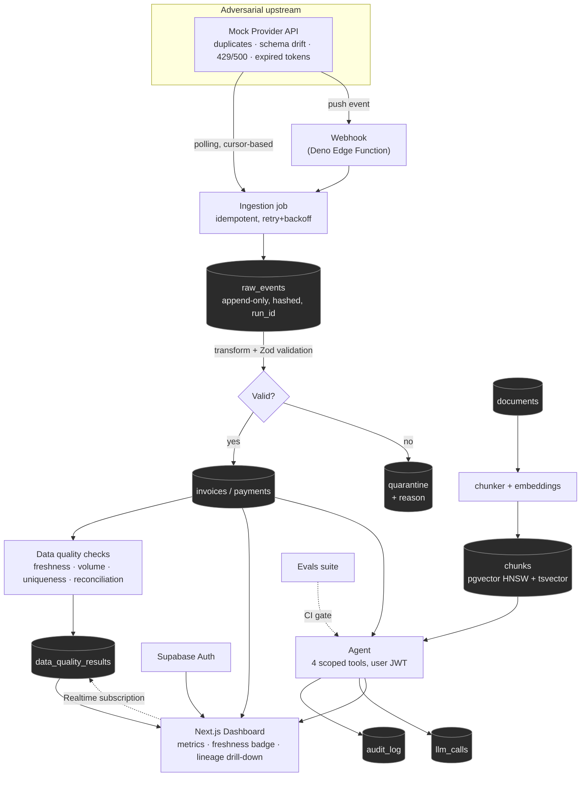
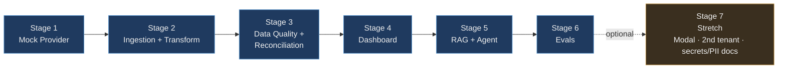
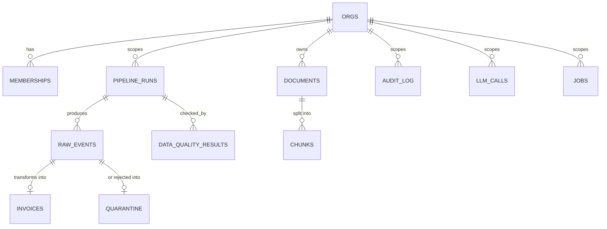
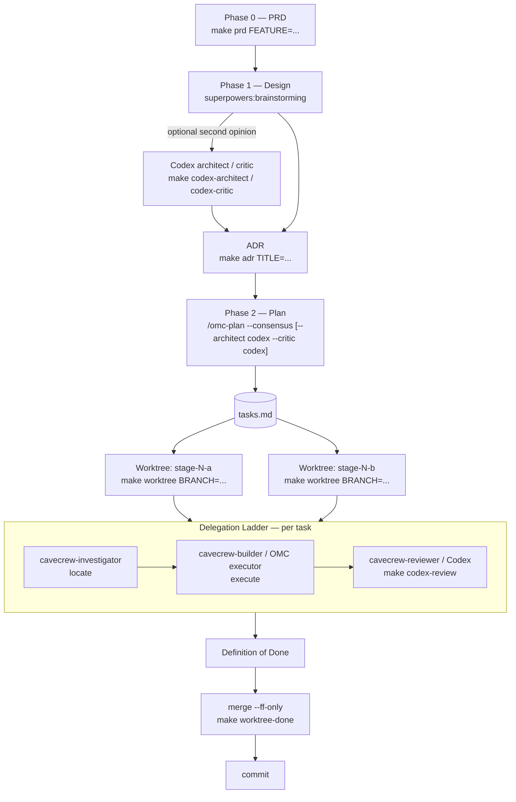

# LedgerLens

**AI copilot over financial data you can actually trust.**

*Status: Stages 1–2 of 7 done (Mock Provider, Ingestion & Transform) · Stage 3 (Data Quality & Reconciliation) next · Stack: Next.js · Supabase/Postgres · pgvector · Pulumi · Bun*

---

## Table of contents

- [Project goal](#project-goal)
- [Killer features](#killer-features)
- [Architecture](#architecture)
- [Business processes](#business-processes)
- [Data model](#data-model)
- [Tech stack](#tech-stack)
- [Meta harness & multi-agent development](#meta-harness--multi-agent-development)
- [Deployment & CI/CD](#deployment--cicd)
- [Trade-offs and honest limitations](#trade-offs-and-honest-limitations)
- [Repository structure](#repository-structure)
- [Project status](#project-status)

---

## Project goal

Most "AI on your data" portfolio projects skip straight to a chat UI wrapped
around whatever's in the database. That's the easy 20%. LedgerLens inverts
the emphasis: the pipeline that guarantees the numbers are *right* is the
bulk of the work, and the AI sits on top as a thin, safety-constrained
layer — because an LLM layered on unvalidated data doesn't fix bad data, it
makes wrong numbers sound more convincing.

Concretely, LedgerLens is a small multi-tenant app that ingests invoices
from a **deliberately adversarial** third-party API, validates and
reconciles them, and puts an AI copilot on top — one that can only answer
from data it can prove, and can only act within tools narrow enough that a
poisoned document in its own corpus can't make it do damage.

The primary audience for this repository is anyone evaluating hands-on
engineering judgment across three things at once: **product full-stack
delivery, reliable data pipelines, and safe agentic AI** — the exact
combination most portfolio projects only demonstrate one of.

---

## Killer features

The parts of this project that carry the most signal per hour of build
time:

| Feature | Why it matters |
|---|---|
| **A mock provider that fights back** | Not a static fixture — it deliberately sends duplicate events, drifts its schema mid-stream, expires tokens, and returns 429s/500s on a schedule. Idempotency, retries, and schema tolerance are *proven*, not asserted. |
| **Reconciliation before/after artifact** | The centerpiece, and now measured: duplicate events overstate the total by **1,389,015 cents (+2.65%)** against the provider's own independent summary; the shipped idempotent pipeline lands on **exactly 0**. Capturing it also exposed a determinism bug that had made zero drift unreachable — [the full write-up](docs/RECONCILIATION_BASELINE.md) is more interesting than the number. |
| **Prompt-injection containment, not prevention** | A poisoned document lives in the RAG corpus on purpose. The agent can't cause harm not because it was told not to, but because the only write-adjacent tool it has *drafts* an email and nothing ever sends one. The attempt is still fully audited. |
| **Lineage drill-down** | Click any dashboard number and see exactly which raw records, which pipeline run, and which source produced it — down to the raw payload. Rare in portfolio projects, immediately convincing in a demo. |
| **Hybrid retrieval with Reciprocal Rank Fusion** | Vector search (pgvector/HNSW) and full-text search combined by RRF, not just one or the other — named and demonstrated, not just mentioned. |
| **Evals as a CI gate, not a notebook** | `recall@5`, citation validity, abstention rate on unanswerable questions, and LLM-as-judge groundedness all block the merge below threshold — the same command runs locally and in CI. |
| **One-command, repeatable infrastructure** | `pulumi up` stands up the entire deployable surface. No hand-ordered sequence of dashboard clicks to remember or get wrong on the second environment. |
| **A harness that enforces its own rules** | The PRD → Design/ADR → plan → code → review pipeline isn't just prose in a file — it's backed by scripts that make the right path the easy path. See [Meta harness](#meta-harness--multi-agent-development). |

---

## Architecture



Invariants that hold everywhere in the system: Postgres **RLS** scoped by
`org_id` on every table, a `correlation_id` on every log line, a `run_id`
on every data row, PII masked wherever it reaches a log or the audit
table, and secrets that never leave `env`/Supabase Vault/Pulumi's secret
store.

For the full entity-relationship diagram, see
[`docs/PROJECT_OVERVIEW.md`](docs/PROJECT_OVERVIEW.md#data-model-core-entities).
For the complete column-level DDL and RLS policies, see
[`docs/DATABASE_SCHEMA.md`](docs/DATABASE_SCHEMA.md).

---

## Business processes

Each stage below is a real business process with its own PRD entry
(problem, user, testable success criteria, non-goals) in
[`.claude/PRD.md`](.claude/PRD.md), and gets its own design + ADR before
code starts, per the workflow in [`CLAUDE.md`](CLAUDE.md).



**1. Mock Provider** — a cursor-paginated invoice API with seven
independently toggleable chaos flags (duplicates, schema drift, null
fields, rate limiting, server errors, expired tokens, future-dated
records), deterministic under a fixed seed so it doubles as a regression
fixture, not just a demo toy.

**2. Ingestion & Transform** — cursor-based incremental pulls with
exponential backoff, jitter, and a circuit breaker; a parallel webhook
path (Deno Edge Function) for genuine event-driven ingestion, not just
polling; Zod-validated transform where invalid records land in
`quarantine` with a reason instead of being silently dropped or blocking
the load.

**3. Data Quality & Reconciliation** — four checks (freshness, volume,
uniqueness, reconciliation) run on every pipeline execution. Reconciliation
compares our summed total against the provider's own independent summary
endpoint — the project's actual differentiator and the strongest artifact
in the whole build.

**4. Dashboard** — Supabase Auth-gated, role-scoped via `memberships`,
with live metrics, a freshness badge, a Data Health panel, cursor-paginated
invoices, lineage drill-down to the raw payload, Realtime-updated pipeline
status, and a thin chat panel over the agent.

**5. RAG & Agent** — hybrid vector + full-text retrieval via Reciprocal
Rank Fusion; exactly four scoped tools running under the calling user's
JWT so Postgres RLS bounds the agent exactly as it bounds the dashboard;
citation validity checked deterministically; every step logged to
`llm_calls` and `audit_log`.

**6. Evals** — a versioned dataset spanning metric/lookup/retrieval/
unanswerable/injection cases, scored on retrieval recall, JSON and
citation validity, abstention rate, and LLM-as-judge groundedness — wired
into CI as a hard gate, not a manual check.

**7. Stretch** — Modal-hosted Whisper transcription (named GPU/serverless
workload, not "Whisper somewhere"), an idempotency-proving backfill script,
a second tenant with a CI isolation test, and explicit secrets/PII
documentation.

---

## Data model

Core entities and how they relate — full DDL and RLS policies in
[`docs/DATABASE_SCHEMA.md`](docs/DATABASE_SCHEMA.md):



Every table is `org_id`-scoped and RLS-enabled; the calling user's JWT
(dashboard *and* agent, identically) determines what rows they can see.

---

## Tech stack

| Layer | Technology |
|---|---|
| Frontend | Next.js, TypeScript, Tailwind CSS, TanStack Query, shadcn/ui |
| Auth & real-time | Supabase Auth (magic link), Supabase Realtime |
| Backend | Next.js API routes, Deno (Supabase Edge Functions), Python (embeddings/evals) |
| Database | Postgres via Supabase — RLS, `pgvector` (HNSW), `tsvector`/GIN, `pgcrypto` |
| AI / LLM | Anthropic or OpenAI API, hybrid RAG (vector + full-text, RRF), 4-tool scoped agent |
| Background work | Postgres queue (`SKIP LOCKED`) + event-driven webhook path |
| Package manager | Bun (`bun`/`bunx`) |
| Infrastructure as Code | Pulumi (TypeScript) — see [Deployment & CI/CD](#deployment--cicd) |
| GPU/serverless (Stage 7) | Modal |
| CI | GitHub Actions |

---

## Meta harness & multi-agent development

This repository is developed through an explicit, enforced pipeline —
not just documented convention, but scripts that make the documented
convention the path of least resistance. Full rules in
[`CLAUDE.md`](CLAUDE.md); full script reference in
[`scripts/harness/README.md`](scripts/harness/README.md).



**The agents involved, and what each one owns:**

- **Superpowers** (`/superpowers:brainstorming`) — architecture and design
  decisions. Every new pipeline stage, agent tool, or schema change starts
  here, never with code.
- **OMC** (`/omc-plan --consensus`) — turns an approved design into an
  atomic `tasks.md` via a Planner → Architect → Critic loop, then
  orchestrates the sub-agents that execute it.
- **Codex** — an explicit second model opinion, not a replacement for
  Claude's own Architect/Critic. Reached for on security/architecture-
  sensitive stages (`--architect codex --critic codex`) and on any diff via
  `make codex-review`. [ADR 0001](.claude/adr/0001-infrastructure-as-code-with-pulumi.md)
  is itself an example of the process working — a decision reversed
  mid-project, documented as a superseding ADR rather than a silent edit.
- **cavecrew** (`cavecrew-investigator` / `cavecrew-builder` /
  `cavecrew-reviewer`) — the cheap, fast execution primitive OMC reaches
  for on small, well-scoped tasks (≤2 files). Anything larger escalates to
  a full OMC `executor`/`architect` subagent rather than being forced
  through a tool that will just refuse it.
- **Git worktrees** — every parallel `tasks.md` item gets its own isolated
  worktree (`make worktree BRANCH=...`), because two agents writing the
  same tree at once silently corrupts migrations and lockfiles. Migrations
  themselves stay strictly sequential even across worktrees — one at a
  time, no exceptions.

**The harness scripts** (`scripts/harness/*.sh`, also reachable via
`Makefile` targets) mechanize the parts of this pipeline that are easy to
get subtly wrong by hand: ADR numbering, PRD section structure, worktree
paths, and the Codex call shape. None of them push, merge, or delete a
branch without an explicit separate step — destructive or public actions
are always a deliberate, visible action, never a side effect.

---

## Deployment & CI/CD

All deployable infrastructure is provisioned through a single Pulumi
program in `infra/` (TypeScript) — `pulumi up` rather than a hand-ordered
sequence of CLI calls across three platforms. Full plan, environment
variable checklist, and readiness checklist in
[`docs/DEPLOYMENT.md`](docs/DEPLOYMENT.md); the full reasoning (including
what changed from an earlier "no IaC" decision) in
[ADR 0001](.claude/adr/0001-infrastructure-as-code-with-pulumi.md).

| Component | Platform | Managed by |
|---|---|---|
| Next.js app | Vercel | Pulumi — native resource |
| Postgres, pgvector, Auth, Realtime | Supabase | Pulumi — command-wrapped `db push` |
| Webhook receiver (Deno) | Supabase Edge Functions | Pulumi — command-wrapped `functions deploy` |
| Whisper transcription (Stage 7) | Modal | Pulumi — command-wrapped `modal deploy` |
| CI / evals gate | GitHub Actions | Workflow file, not deployable infra |

Two honest tiers of "managed by Pulumi," stated plainly rather than
presented as uniform coverage: **native resources** (Vercel) get a real
dependency graph and drift detection; **command-wrapped steps** (Supabase,
Modal, via `@pulumi/command`) are still orchestrated by one `pulumi up`,
but are only as idempotent as the underlying CLI — no mature native
Pulumi provider covers those operations well enough yet to justify the
setup cost.

State lives in Pulumi Cloud's free tier, not a local file in the repo.
Secrets go through `pulumi config set --secret`, never as plaintext.

**CI** runs `make evals` on every PR — the same command locally and in
CI, so there's no "works on my machine" drift — and blocks merges below
threshold. CI does **not** run `pulumi up`; infra changes deploy from a
developer machine after `pulumi preview` has been reviewed, never
automatically on merge.

---

## Trade-offs and honest limitations

Knowing the limits of your own system is the clearest signal available —
so here they are, not hidden in a changelog:

| Decision | Trade-off accepted | Revisit when |
|---|---|---|
| pgvector, not a dedicated vector DB | Gains transactions, joins with business data, and RLS on the same rows; loses whatever a purpose-built vector store would offer at scale | Recall measurably degrades or index rebuild times start hurting |
| RRF, not a cross-encoder reranker | Cheap, good enough for this corpus size; leaves precision on the table | Retrieval quality becomes the bottleneck the evals suite reveals |
| Postgres queue (`SKIP LOCKED`), not a dedicated queue | One less moving part for a solo project; caps throughput | Throughput actually requires it |
| Command-wrapped Supabase/Modal in Pulumi, not native resources | One `pulumi up` for everything; those two legs aren't independently drift-checked by Pulumi | Supabase resource management grows past two operations |
| Exactly 4 agent tools, none with real side effects | Tight safety story; genuinely less agent capability | Never, without a matching increase in the audit/approval story |
| No dedicated per-tenant partial vector indexes | Simpler now; approximate search + a selective tenant filter can drop recall for small tenants | A second tenant's recall is measured and found wanting |
| Infrastructure as Code (Pulumi) — reversed from an earlier "skip IaC" call | Real dependency + maintenance cost added mid-project, for repeatable multi-environment deploys | Already revisited once — see [ADR 0001](.claude/adr/0001-infrastructure-as-code-with-pulumi.md) |

---

## Repository structure

```
CLAUDE.md                    Workflow rules — the actual source of truth
README.md                    This file
Makefile                     make targets wrapping scripts/harness/
.claude/
  PRD.md                     Product requirements — one section per stage
  DESIGN.md                  Approved architecture (created per Phase 1)
  adr/                       Architecture Decision Records, sequentially numbered
docs/
  PROJECT_OVERVIEW.md        Architecture, data model, roadmap, agent safety flow
  DATABASE_SCHEMA.md         Full SQL DDL + RLS policies
  LOCAL_DEV.md               Running locally, verifying a stage, IDE database setup
  DEPLOYMENT.md              Deploy plan, env vars, CI, readiness checklist
  RECONCILIATION_BASELINE.md The before/after drift measurement
postman/
  *.postman_collection.json  The same checks as a Postman collection
  *.template.json            Environment template; the real one is generated
scripts/
  smoke.sh                   End-to-end checks against the running app, per stage
  postman-env.sh             Generates the Postman environment from the local stack
  harness/                   The meta-harness scripts + their own README
supabase/
  migrations/                Schema + RLS, applied in order by `supabase db reset`
  seed.sql                   Two local tenants + auth users (local stack only)
  functions/                 Deno Edge Functions (provider-webhook)
infra/                       Pulumi program (added once Stage 1 needs a real deploy)
```

`interview-preps/` exists locally but is gitignored — personal reference
material, not part of this repository's tracked history or deliverable.

---

## Project status

Two ways development is counted here, both explained in
[`docs/PROJECT_OVERVIEW.md`](docs/PROJECT_OVERVIEW.md#roadmap-to-production)
and tracked live in [`PROGRESS.md`](PROGRESS.md):

- **Workflow phases** (per stage): Phase 0 (PRD) → Phase 1 (Design + ADR)
  → Phase 2 (plan + code). Applies fresh to each stage below.
- **Build stages** (the actual work, 7 total, see
  [Business processes](#business-processes)): sequential, Stage *N*
  depends on Stage *N-1* shipping first.

**Where things stand — Stages 1–2 of 7 done:**

- ✅ **Setup** — project layout decided ([ADR 0002](.claude/adr/0002-project-layout-single-next-js-app-no-monorepo.md)),
  Next.js app scaffolded, Supabase initialized.
- ✅ **Stage 1 — Mock Provider** — done. Seven chaos flags, deterministic
  under seed.
- ✅ **Stage 2 — Ingestion & Transform** — done. Polling route + webhook
  Edge Function sharing one transform and one atomic write path
  ([ADR 0003](.claude/adr/0003-bounded-per-invocation-polling-ingestion-no-job-queue.md),
  [ADR 0004](.claude/adr/0004-atomic-single-record-ingest-in-postgres-not-two-client-round-trips.md)).
  Schema live with RLS on every table from the migration that created it.
  **Reconciliation baseline banked:** drift +2.65% before idempotency,
  exactly 0 after — see [`docs/RECONCILIATION_BASELINE.md`](docs/RECONCILIATION_BASELINE.md).
- ✅ **Local verification loop** — the whole stack runs on one machine
  (`make dev-up`, `bun run dev`) against a seeded two-tenant local
  Postgres, and `scripts/smoke.sh` asserts each stage end-to-end over
  HTTP: 19 checks, all green. The same ground is covered by a Postman
  collection (`postman/`, 47 assertions over 20 requests) for when
  watching the traffic beats a pass/fail line — and it reaches one thing
  the shell suite cannot, a real GoTrue sign-in, so RLS is exercised
  through a genuine JWT. Setup, curl recipes, and IDE database
  connection in [`docs/LOCAL_DEV.md`](docs/LOCAL_DEV.md).
- ⬜ **Stage 3 — Data Quality & Reconciliation** — next up. The project's
  actual differentiator; its headline input is already measured.
- ⬜ Stages 4–6 — not started.
- ⬜ Stage 7 (Stretch) — optional, independent of the production bar.

Full per-stage checklist and per-agent tracking: [`PROGRESS.md`](PROGRESS.md).
That file is the single source of truth for current stage — this section
and the status badge above just need to stay consistent with it (see
`CLAUDE.md`'s Definition of Done, item 8).
