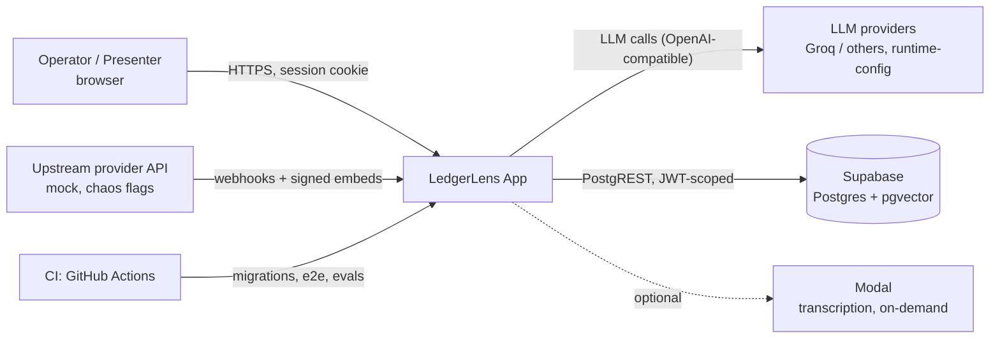
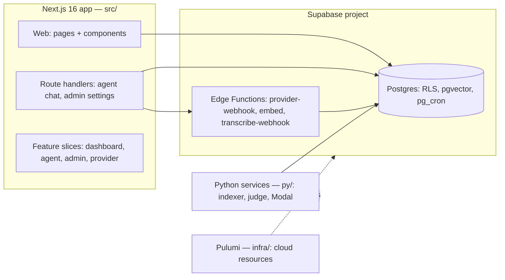
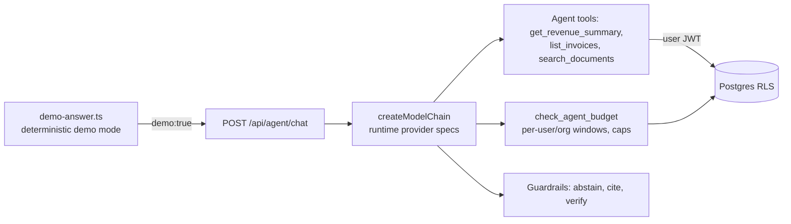

# Architecture — C4 Model

LedgerLens modelled with the [C4 model](https://c4model.com/) (Context → Container → Component → Code). Diagrams are mermaid; captions are <=100 words. The system is deliberately small: one deployment unit, a handful of containers.

## Level 1 — Context

Caption: the app is the only system of record for the browser. Data arrives from one upstream (a mock provider with seven chaos flags) and is stored in Supabase Postgres; the copilot calls an LLM through runtime-configurable providers. CI deploys schema and verifies behaviour end to end.

## Level 2 — Containers

Caption: one Next.js app (server components + route handlers, no BFF) talks to Supabase Auth/Postgres and to edge functions for webhook and embedding work. Python services do heavy indexing and evals; Pulumi owns the cloud resources.

## Level 3 — Components (agent slice)

Caption: the chat route composes a model chain from runtime settings. Every tool call is scoped by the caller's JWT through RLS; budget checks gate requests; demo mode short-circuits to deterministic answers marked demo:true.

## Level 4 — Code

Code-level views live in the code itself: `src/features/*` are the vertical slices, `supabase/migrations/` is the schema truth, and specs/ maps each lane to its tests. See docs/ARCHITECTURE.md for the data flow and docs/PATTERNS.md for the idioms.

Links: [c4model.com](https://c4model.com/) · context: docs/RUNBOOK.md · data model: docs/DATA_MODEL.md · decisions: docs/DECISIONS.md
<!-- proof: src/features/agent/demo-answer.ts -->
<!-- proof: src/features/agent/providers/chain.ts -->
<!-- proof: src/features/dashboard/queries.ts -->
<!-- proof: docs/ARCHITECTURE.md -->
