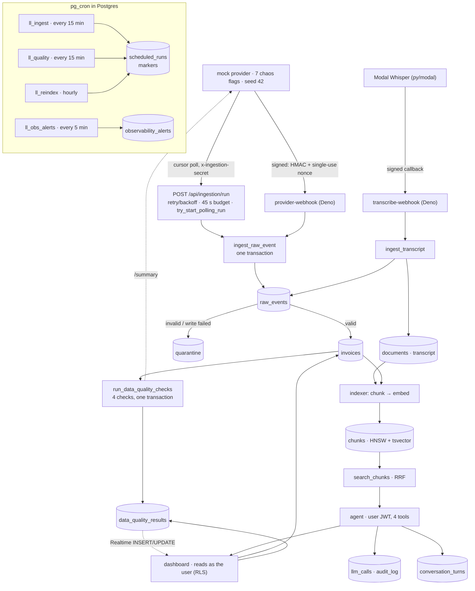
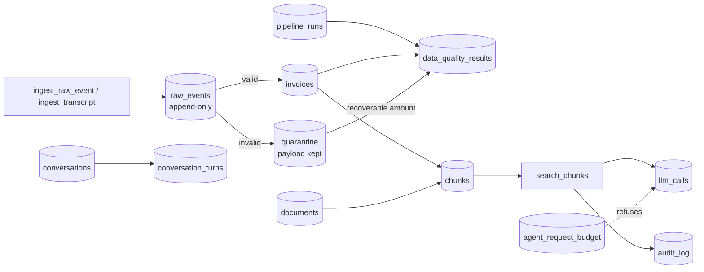
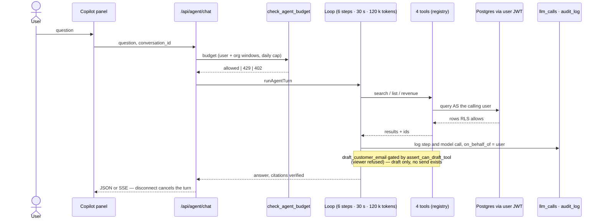

# LedgerLens — Architecture

Diagrams first; the prose under each adds only what the diagram cannot say.
Every claim carries a `<!-- proof: ... -->` marker whose target must resolve —
`task docs-check` fails when one does not (spec 0012).

## 1. System flow

_Flow._ Two ingestion paths share one Zod transform and one atomic write, so
idempotency is proven once. The polling route runs on an authenticated POST
with the shared secret; pg_cron writes `scheduled_runs` markers as the
schedule's side effect and audit trail — nothing in this tree consumes them
yet. Transcription is a third path into the same pipeline: signed callback,
`ingest_transcript`, then documents and chunks. A succeeded run closes with
the four quality checks. The dashboard reads Postgres under the signed-in
user's JWT — RLS is the authorization; the agent consumes the same RLS.
## 2. Data flow and lineage

_Lineage._ `raw_events` is the append-only record of what arrived; its unique
`(org_id, source, external_id, event_version)` key is the idempotency key.
Ingestion-lineage rows carry `run_id` (`raw_events`, `invoices`, `quarantine`,
`documents`, `data_quality_results`). `quarantine` keeps the original
payload, so reconciliation counts it as accounted value. `chunks` is a
derived index over invoices and documents — the one DELETE allowance.
`search_chunks` is SECURITY INVOKER, so RLS on `chunks` is the only
authorization. The budget table refuses requests before a model call;
`llm_calls` and `audit_log` record every step a turn took.
## 3. Agent safety

_Safety._ The agent holds no service-role credential: tools query through the
caller's JWT, so RLS bounds reads exactly as it bounds the dashboard. The
registry is four tools — three read-only, one draft-only — and the draft gate
lives in the database (`assert_can_draft_tool`). Citations are verified
deterministically against what a tool returned; an answer over empty
retrieval abstains. Every model call and tool call is audited. Bounds (6
steps, 30 s, 120 k tokens) end the turn with a stated reason, never a
truncated answer. The eval suite scores recall, abstention, injection safety
and citation validity against fixed thresholds.
## Facts that need saying
- The scheduler enqueues markers; nothing consumes them in this tree. The
  ingestion route runs on an authenticated POST, not on a cron trigger.
- PII masking, Supabase Vault and a Postgres "job queue" (SKIP LOCKED) do
  not exist in this codebase; earlier documents claimed all three (D-02,
  D-06). `scheduled_runs` is a marker table, not a queue.
- The observability metrics are SQL views (`freshness_lag`,
  `ingest_error_rate`, `agent_p95_latency`, `llm_daily_cost`); alerts are
  rows written by a pg_cron job.
- Invariants and the ER diagram: `docs/DATA_MODEL.md`. Run and deploy:
  `docs/RUNBOOK.md`. Reconciliation measurement: `docs/RECONCILIATION.md`.
<!-- proof: src/app/api/ingestion/run/route.ts:INGESTION_TRIGGER_SECRET --> <!-- proof: src/app/api/ingestion/run/route.ts:RUN_BUDGET_MS --> <!-- proof: src/features/ingestion/transform.ts:validateInvoice --> <!-- proof: src/features/ingestion/cursor.ts:countersBalance -->
<!-- proof: supabase/functions/provider-webhook/index.ts:consume_request_nonce --> <!-- proof: supabase/functions/_shared/signature.ts:canonicalString --> <!-- proof: migration:20260821120000 --> <!-- proof: migration:20260821110000 -->
<!-- proof: migration:20260818103000 --> <!-- proof: migration:20260821150000 --> <!-- proof: migration:20260819120000 --> <!-- proof: supabase/functions/embed/index.ts:MAX_TEXTS -->
<!-- proof: migration:20260819160000 --> <!-- proof: migration:20260819180000 --> <!-- proof: src/features/rag/search.ts:DEFAULT_MIN_SIMILARITY --> <!-- proof: src/app/api/agent/chat/route.ts:checkAgentBudget -->
<!-- proof: src/features/agent/tools/index.ts:TOOL_COUNT --> <!-- proof: src/features/agent/loop.ts:MAX_STEPS --> <!-- proof: src/features/agent/loop.ts:TURN_BUDGET_MS --> <!-- proof: src/features/agent/loop.ts:TOKEN_CEILING -->
<!-- proof: src/features/agent/citations.ts:verifyCitations --> <!-- proof: migration:20260821100000 --> <!-- proof: migration:20260819190000 --> <!-- proof: migration:20260821170000 -->
<!-- proof: migration:20260821160000 --> <!-- proof: src/platform/supabase/server-client.ts --> <!-- proof: src/features/quality/run-checks.ts:fetchProviderSummary --> <!-- proof: tests/helpers/stack.ts -->
<!-- proof: src/features/provider/data.ts --> <!-- proof: task docs-check -->
