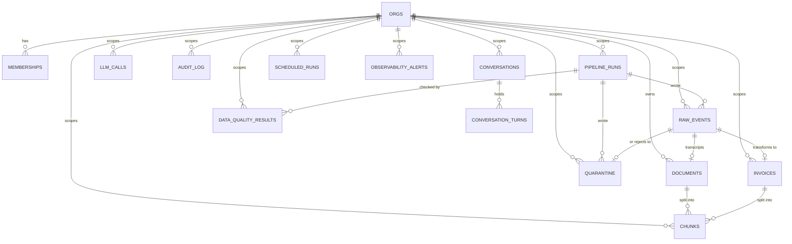

# LedgerLens — Data Model

The DDL is the migrations: `supabase/migrations/**` — 22 files, applied in
filename order by `supabase db reset`. The typed view is
`src/platform/supabase/database.types.ts`, regenerated by `task types` and
pinned by `task types-check`. This page is the map and the invariants, not a
restatement of either.

## ER diagram — what the migrations create

Not in the diagram, because they are not tenant data: `agent_request_budget`
(rate-limit counters, written only by `check_agent_budget`),
`signed_request_nonces` (single-use webhook nonces, closed to every Data API
role), `observability_alert_thresholds` (global config), and the four
metrics views `freshness_lag`, `ingest_error_rate`, `agent_p95_latency`,
`llm_daily_cost` — created with `security_invoker`, so the RLS of the tables
underneath decides what a caller sees.

## Invariants

| Invariant | Where it is enforced |
|---|---|
| RLS enabled on every table | each migration that creates a table; `tests/rls-coverage.spec.ts` walks the catalog and fails a table without it |
| `org_id` scoping | every tenant table is `org_id`-scoped; `orgs` is the tenant root (readable only by members); policies read membership from `memberships` |
| Append-only audit | `authenticated` holds SELECT only; writes go through SECURITY DEFINER functions that stamp `auth.uid()` (`log_llm_call`, `log_agent_action`, `save_conversation_turn`) |
| One DELETE allowance | `chunks` is a derived index, so service_role may delete it; no other table grants DELETE to any Data API role |
| Idempotency key | `raw_events` unique `(org_id, source, external_id, event_version)` + `ON CONFLICT DO NOTHING` in `ingest_raw_event` / `ingest_transcript`, with a downstream-row check that heals orphans |
| One running run per org | partial unique index `pipeline_runs(org_id) where status='running'`, plus an org advisory lock inside `try_start_polling_run` so the refusal is clean, not a 500 |
| `run_id` on ingestion-lineage rows, `correlation_id` on every log line | `raw_events`, `invoices`, `quarantine`, `documents`, `data_quality_results`; AGENTS.md makes it a standing rule |

## Honest notes

- There is no JOBS table and no Postgres queue with SKIP LOCKED (D-02).
  `scheduled_runs` is the scheduler's marker table: pg_cron jobs enqueue
  rows, a run would mark one done when it picks it up — nothing consumes the
  markers in this tree yet.
- PII masking and Supabase Vault were claimed in old docs but never built
  (D-06); nothing here implements them.

<!-- proof: supabase/migrations/20260817135445_stage2_ingestion_core_tables.sql -->
<!-- proof: supabase/migrations/20260818094500_stage2_explicit_data_api_grants.sql --> <!-- proof: migration:20260819160000 --> <!-- proof: migration:20260819170000 -->
<!-- proof: migration:20260819190000 --> <!-- proof: migration:20260821100000 --> <!-- proof: migration:20260821110000 --> <!-- proof: migration:20260821120000 -->
<!-- proof: migration:20260821150000 --> <!-- proof: migration:20260821160000 --> <!-- proof: migration:20260821170000 --> <!-- proof: migration:20260818103000 -->
<!-- proof: src/platform/supabase/database.types.ts --> <!-- proof: tests/rls-coverage.spec.ts --> <!-- proof: task types --> <!-- proof: task types-check -->
<!-- proof: src/features/agent/audit.ts:logLlmCall --> <!-- proof: src/features/agent/audit.ts:logAgentAction --> <!-- proof: src/app/api/ingestion/run/route.ts:try_start_polling_run --> <!-- proof: src/features/ingestion/constants.ts:EVENT_VERSION -->
