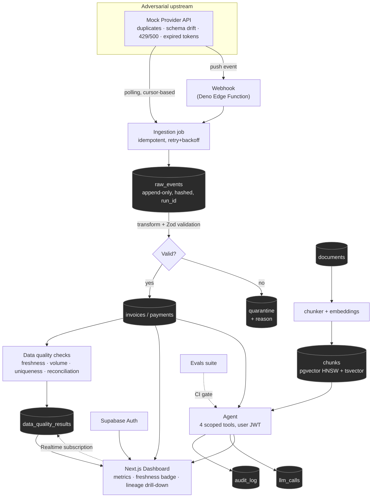
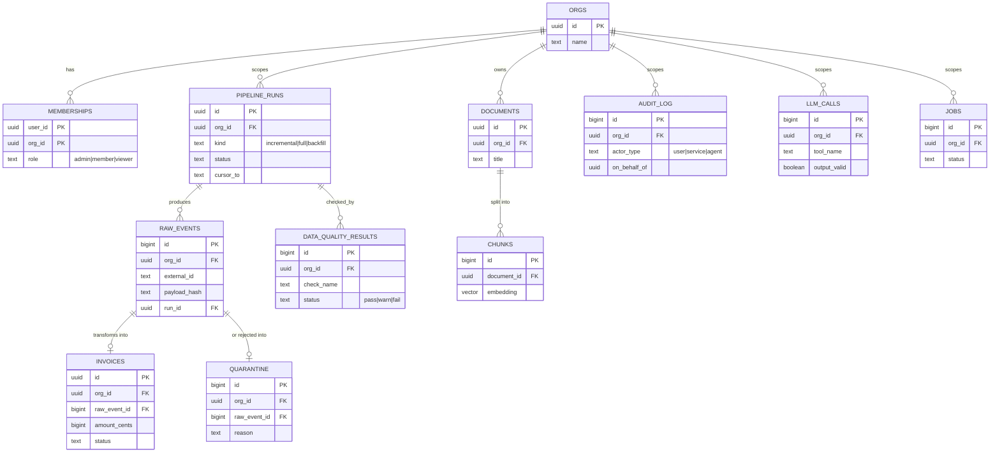
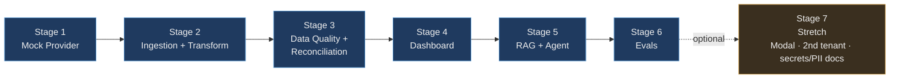
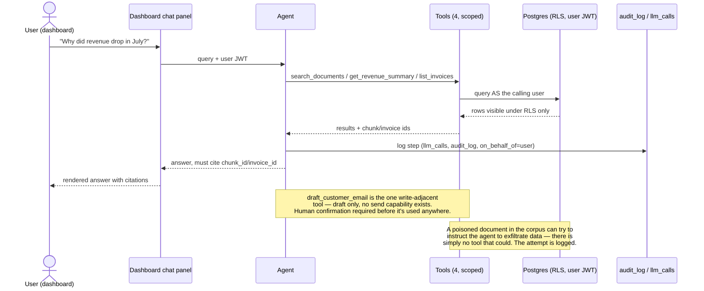

# LedgerLens — Project Overview

**AI copilot over financial data you can actually trust.**

This is the working overview of the LedgerLens project: what it is, how the
pieces fit together, and where to go for more detail. For the full database
schema, see [`docs/DATABASE_SCHEMA.md`](DATABASE_SCHEMA.md). To run it on
your machine and verify a stage by hand, see
[`docs/LOCAL_DEV.md`](LOCAL_DEV.md). For the
deployment plan, see [`docs/DEPLOYMENT.md`](DEPLOYMENT.md). For scoped
requirements per stage, see [`.claude/PRD.md`](../.claude/PRD.md). For
workflow rules (how work gets planned and executed), see
[`CLAUDE.md`](../CLAUDE.md).

Everything linked above is self-contained in this repository — nothing
required to understand or build the project lives only in the gitignored,
personal `interview-preps/` notes.

---

## Elevator pitch

A small multi-tenant app that ingests invoices from a third-party API,
validates and reconciles them, and puts an AI copilot on top — one that can
only answer from data it can prove, and can only act within tools narrow
enough that a poisoned document can't make it do damage.

The interesting part isn't the AI. It's that the upstream data source is
deliberately adversarial (duplicate events, schema drift, expired tokens,
outages), so the pipeline has to prove it survives exactly the failures a
real integration would hit — and the AI layer sits on top of *that*, not on
top of blind trust.

---

## Problem

An LLM layered on unvalidated data doesn't fix bad data — it makes wrong
numbers sound more convincing. Most "AI on your data" portfolio projects
skip the validation layer entirely and go straight to a chat UI. LedgerLens
inverts the emphasis: the pipeline that guarantees the numbers are right is
the bulk of the work, and the AI is a thin, safety-constrained layer on top
of it.

---

## Architecture

Everywhere: Postgres RLS scoped by `org_id`, `correlation_id` in every log
line, `run_id` on every data row. See the full SQL schema in
[`docs/DATABASE_SCHEMA.md`](DATABASE_SCHEMA.md).

---

## Data model (core entities)

Full column-level DDL (including RLS policies) lives in
[`docs/DATABASE_SCHEMA.md`](DATABASE_SCHEMA.md).

---

## Build roadmap

Each stage has its own PRD entry (problem, user, testable success criteria,
non-goals) in [`.claude/PRD.md`](../.claude/PRD.md), and per `CLAUDE.md`'s
Phase 1, gets its own `.claude/DESIGN.md` section + ADR before code starts.
Stage 3 (Data Quality & Reconciliation) is the project's actual
differentiator — the before/after reconciliation-drift number is the
strongest single artifact in the whole build, and it is now measured live
on every run rather than captured once by a script.

---

## Agent safety flow

The part of the system the JD is most anxious about: an AI feature that can
*act*, not just answer. Safety here comes from what the agent physically
cannot do, not from a system prompt asking it to behave.

---

## Where things stand

- **Layout decided:** single Next.js app (Bun), no monorepo — see
  [ADR 0002](../.claude/adr/0002-project-layout-single-next-js-app-no-monorepo.md)
  and the "Project Layout" section in [`.claude/DESIGN.md`](../.claude/DESIGN.md).
  App scaffolded, dependencies installed, build verified, `supabase init`
  done.
- **Code:** Stages 1–3 done, Definition of Done passed on each. Stage 1
  (Mock Provider), Stage 2 (Ingestion & Transform: polling route + webhook
  Edge Function, live Postgres schema with RLS, atomic write path per
  ADR 0004), Stage 3 (Data Quality & Reconciliation: four checks in one
  Postgres function per ADR 0005, recorded per `run_id`). Stage 4
  (Dashboard, and the first `infra/` deploy) next.
- **Reconciliation baseline captured:** +2.65% drift before idempotency,
  exactly 0 after — [`docs/RECONCILIATION_BASELINE.md`](RECONCILIATION_BASELINE.md).
  This is Stage 3's headline input, banked during Stage 2 as its PRD
  requires, and now measured live by Stage 3's reconciliation check on
  every run — invoiced 47,942,632 + quarantined 4,475,029 against the
  provider's independent 52,417,661.
- **Runs locally:** the full stack (Next.js + Supabase in Docker, seeded
  with two tenants) comes up with `task dev-up` + `task dev`, and a
  Playwright suite asserts each stage end-to-end over HTTP — 38 tests
  green, the webhook Edge Function included. `task` with no arguments
  lists every local command; `task docker-up` runs the production build as
  a container beside that stack ([ADR 0006](../.claude/adr/0006-the-app-is-containerised-the-supabase-stack-is-not-duplicated.md)).
  See [`docs/LOCAL_DEV.md`](LOCAL_DEV.md), which also covers connecting
  IntelliJ IDEA/DataGrip to the database.
- **Progress tracking:** see [`PROGRESS.md`](../PROGRESS.md) at the repo
  root — a kanban-style board tracking every stage from here to Definition
  of Done, plus which agent/harness role did each step.
- **Deploy readiness:** see [`docs/DEPLOYMENT.md`](DEPLOYMENT.md)'s
  readiness checklist — the repo is meant to be push/deploy-ready at any
  point, not just at the end.

## Roadmap to production

1. **Setup** — scaffold the Next.js app once, before Stage 1, not deferred
   to Stage 4 (ADR 0002). Done.
2. **Stages 1–6, sequential** — each stage: design (if it has a real
   fork) → `/omc-plan --consensus` → `tasks.md` → worktree + Delegation
   Ladder → Definition of Done → merge. Stage 4 and Stage 5 route through
   `--architect codex --critic codex` (auth/RLS/agent-surface changes).
   **Stages 1–3 done**, DoD passed on each — see
   [`PROGRESS.md`](../PROGRESS.md) for each stage's checklist and what was
   carried forward. Stage 4 (Dashboard) next; Stages 5–6 not started.
3. **First live deploy — at Stage 4.** `infra/` (Pulumi) gets built here,
   not before: this is the first point there's a real app + schema worth
   standing up. `pulumi up` runs for the first time at this stage.
4. **Stage 5** — first point real LLM secrets matter; set through Pulumi
   config, never committed.
5. **Stage 6** — CI eval gate goes live in GitHub Actions. Once this
   merges, the project meets this build's definition of "production":
   deployed, gated, evaluable end-to-end.
6. **Cutover** — run `docs/DEPLOYMENT.md`'s readiness checklist,
   `pulumi preview` → `pulumi up` for the final deploy, fill the README's
   real artifacts (reconciliation before/after number, failure-mode
   table, security model, prompt-injection transcript) from the live
   system, rehearse the pitch against it.
7. **Stage 7 (optional)** — attempted independently, any subset, never at
   the cost of a Stage 1–6 regression. Not required to hit the production
   bar above.
