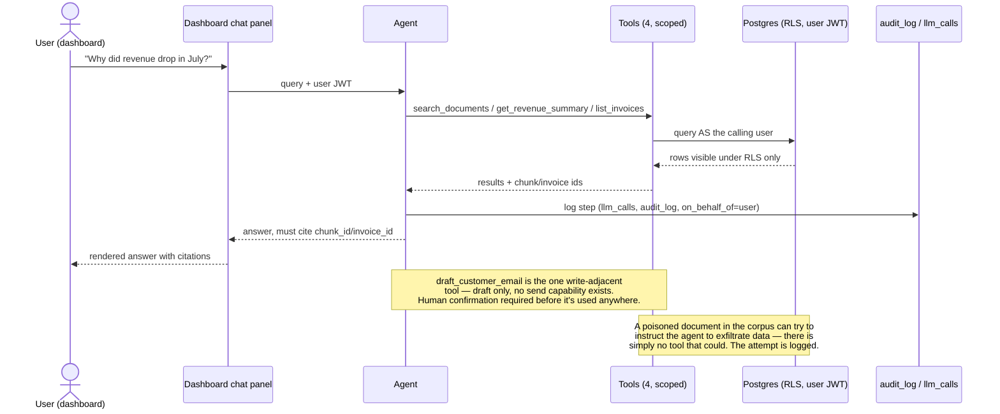

# LedgerLens — Architecture

How the pieces fit together and why. For what the project is and how to run it,
see [`README.md`](../README.md); for current state, [`PROGRESS.md`](../PROGRESS.md);
for column-level DDL and RLS policies, [`DATABASE_SCHEMA.md`](DATABASE_SCHEMA.md).

## The seven stages

Each stage is a real business process with its own entry in
[`.claude/PRD.md`](../.claude/PRD.md) — problem, users, testable success
criteria, non-goals — and an ADR for any decision expensive to reverse.

**1. Mock Provider.** A cursor-paginated invoice API with seven independently
toggleable chaos flags: duplicates, schema drift, null fields, rate limiting,
server errors, expired tokens, future-dated records. Deterministic under a fixed
seed, so it doubles as a regression fixture rather than a demo toy.

**2. Ingestion & Transform.** Cursor-based incremental pulls with exponential
backoff, jitter and a circuit breaker, plus a parallel webhook path (a Deno Edge
Function) for genuine event-driven ingestion. Both paths run the same
Zod-validated transform and the same atomic Postgres write, so idempotency and
validation are proven once rather than implemented twice. Invalid records land
in `quarantine` with a reason instead of being dropped or blocking the load.

**3. Data Quality & Reconciliation.** Four checks — freshness, volume,
uniqueness, reconciliation — run as one Postgres function in one transaction and
recorded per `run_id`. Reconciliation compares the summed total against the
provider's own independent summary endpoint. This is the project's actual
differentiator, and it is measured on every run rather than captured once.

**4. Dashboard.** One authenticated page over Stages 1–3: metrics, a freshness
badge, a Data Health panel, cursor-paginated invoices, lineage drill-down to the
raw payload, and Realtime pipeline status. It reads Postgres directly under the
signed-in user's JWT, so RLS is the authorization mechanism rather than a second
copy of it in application code — [ADR 0007](../.claude/adr/0007-the-dashboard-reads-through-the-users-own-jwt-rls-is-the-only-authorization.md).

**5. RAG & Agent.** Hybrid vector and full-text retrieval combined by Reciprocal
Rank Fusion; exactly four scoped tools running under the calling user's JWT, so
Postgres bounds the agent exactly as it bounds the dashboard. Citations are
checked deterministically; every step is logged to `llm_calls` and `audit_log`.

**6. Evals.** A versioned dataset spanning metric, lookup, retrieval,
unanswerable and injection cases, scored on retrieval recall, JSON and citation
validity, abstention rate and LLM-as-judge groundedness — wired into CI as a hard
gate, not a manual check.

**7. Stretch (optional).** Modal-hosted Whisper transcription, an
idempotency-proving backfill script, a second tenant with a CI isolation test,
and explicit secrets/PII documentation.

---

## Data model

Every table is `org_id`-scoped with RLS enabled from the migration that created
it. The calling user's JWT — dashboard and agent identically — determines which
rows come back.

---

## Agent safety

An AI feature that can *act*, not just answer. Safety comes from what the agent
physically cannot do, not from a system prompt asking it to behave.

---

## Deployment

Everything deployable is provisioned by one Pulumi program in `infra/`
([ADR 0001](../.claude/adr/0001-infrastructure-as-code-with-pulumi.md)), built
at Stage 4 — the first point there is a real app and schema worth standing up.

| Component | Platform | Managed by |
|---|---|---|
| Next.js app | Vercel | Pulumi — native resource |
| Postgres, pgvector, Auth, Realtime | Supabase | Pulumi — command-wrapped `db push` |
| Webhook receiver (Deno) | Supabase Edge Functions | Pulumi — command-wrapped `functions deploy` |
| Whisper transcription (Stage 7) | Modal | Pulumi — command-wrapped `modal deploy` |
| CI / evals gate | GitHub Actions | Workflow file, not deployable infra |

Two honest tiers, stated rather than presented as uniform coverage: **native
resources** (Vercel) get a real dependency graph and drift detection;
**command-wrapped steps** are still orchestrated by one `pulumi up` but are only
as idempotent as the underlying CLI. State lives in Pulumi Cloud, secrets go
through `pulumi config set --secret`.

CI runs `task evals` on every PR — the same command locally and in CI — and
blocks merges below threshold. CI does **not** run `pulumi up`; infra deploys
from a developer machine after a reviewed `pulumi preview`.

Full environment-variable and readiness checklists: [`DEPLOYMENT.md`](DEPLOYMENT.md).
